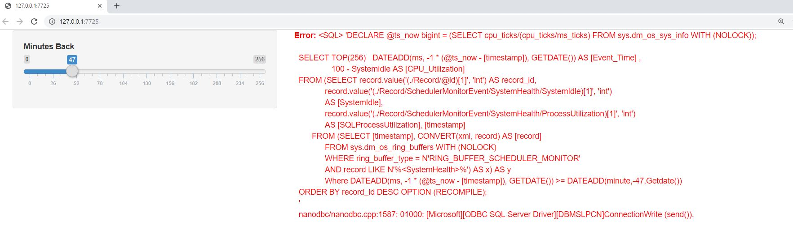
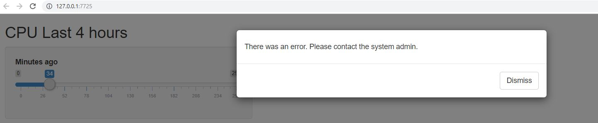

## Error Handling


<iframe src="https://giphy.com/embed/1RkDDoIVs3ntm" width="480" height="480" frameBorder="0" class="giphy-embed" allowFullScreen></iframe><p><a href="https://giphy.com/gifs/1RkDDoIVs3ntm">via GIPHY</a></p>


--

---

How would the app respond to a database error?



---

```{r,eval=FALSE}
results <- dbGetQuery(pool,myquery)
ggplot(results,aes(Event_Time,CPU_Utilization)) + geom_line()
    
```

--

```{r,eval=FALSE}
tryCatch({
{{ results <- dbGetQuery(pool,myquery)}}
{{ggplot(results,aes(Event_Time,CPU_Utilization))+ geom_line()}}
 },error =function(e) {
    showModal(modalDialog(
    h5('There was an error.  Please contact the system admin.")
      )
      )
  })
```


--




---

## Handling Deadlocks

```{r,eval=FALSE}
tryCatch({
    dbGetQuery(con,myquery)
}
,error = function(e){
  {{if(grep('1205',e$message)==1){}}
    while (x<4){
      tryCatch({
        dbGetQuery(con,myquery)
        break
        }
      ,error=function(e){
      x<<- x+1
      })
    }
  }
})
```

---


class: inverse, center, middle


##  Error Handling Demo


---


## Demo Recap

- Forced database offline during active session

--

- No error handling displayed errors at the client and crashed session

--

- Added tryCatch around connection attempt and query attempt


