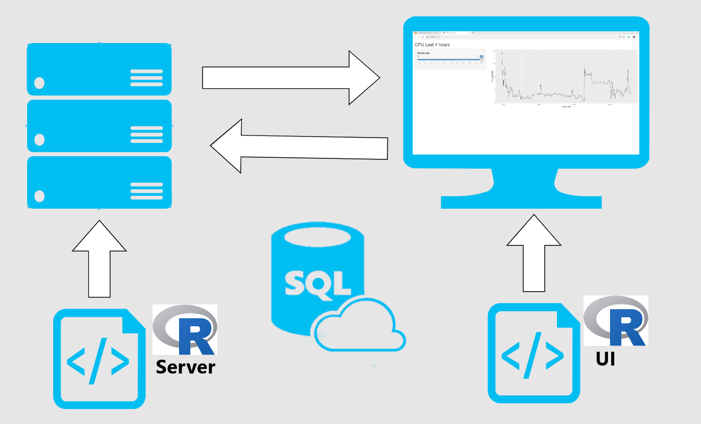

## From IT to Data Science

At my previous employer, I worked in IT operations as a Database Administrator.  In March of 2018, a colleague on the Data Science team approached me about an internal job posting.  His team was looking for a Data Engineer to support its data pipeline.   I had already worked with the team on a IT project and fe support tickets, so I had an approximate idea of what skills they needed.  I was about to graduate with a Masters in  Analytics, and the opportunity seemed relevant.  After thinking things over, I decided the best route forward was to take the job.

A team member resigned shortly after I signed on.  I took on some of his projects, including the development of a web-app.  I had barely changed my email signature before I started getting feature requests on the app.  I couldn't speak to the feasibility of the requests because I didn't have experience in the application stack.  In fact, I didn't have much web-app experience in general as I've been a database specialist my entire career.  After several discussions with stakeholders,  I pressed the reset button.

## R you serious?

I decided to re-write the app using R with a SQL Server back-end.  At that point, I had hundreds of hours of R coding experience from grad school and side projects.  Also, most of my coworkers were Data Scientists and had strong R programming skills.  If I had any gaps in my knowledge, they could help. 

The Shiny package in R generates about 95% of the  HTML, CSS, and JavaScript needed to build a web-app.  For example, if I wanted "Hello World!" to appear in the browser, I would have needed to declare it inside of &lt;h2> tags.  However, with Shiny I called the h2() function.


```{r,eval=FALSE,echo=TRUE}
<h2>Hello World!</h2>
```

<h2>Hello World!</h2>

```{r,eval=TRUE,echo=TRUE}
library(shiny)

h2('Hello World!')
```

This code generates a date input control.

```{r,eval=FALSE,echo=TRUE}
dateRangeInput("date",
               strong("Date range"),
               start = "2007-01-01",
               end = "2017-07-31",
               min = "2007-01-01",
               max = "2017-07-31"
               )

```

Here's the generated HTML.

```{r,eval=FALSE,echo=TRUE}
<div id="date">
<label class="control-label" for="date"> <strong>Date range</strong>
</label><div class="input-daterange input-group">
<input class="input-sm form-control" type="text"
data-date-week-start="0" data-date-format="yyyy-mm-dd"
data-date-start-view="month" data-min-date="2007-01-01"
data-max-date="2017-07-31"data-initial-date="2007-01-01"
data-date-autoclose="true"/><span class="input-group-addon">
to </span> <input  type="text" data-date-language="en"
data-date-week-start="0" data-date-format="yyyy-mm-dd"
data-min-date="2007-01-01" data-max-date="2017-07-31"/>
  </div></div>
```

## The Gameplan

My strategy was to push as much logic and data processing to the database as possible.  I felt this was the best route because, again, most of my experience is on the database side.  I also had concerns about R performance. R by default runs on one thread whereas SQL server by default can multi-thread.  

I knew code generators were great for productivity but often at the cost of performance and functionality.  It wasn't clear to me how the app would handle database connections, application errors, or perform with multiple user sessions.   As I progressed on the project, I learned a few techniques that put those concerns to rest.  It's my goal in this post to share those techniques.

## App Architecture

Before we can start discussing performance tuning, we must establish the basics. The main components of my Shiny app are UI, the Server object, and the database.





The code below provides the base components required for a Shiny database app.  Multiple projects can use this template as a starting point.


```{r,eval=FALSE}
library(shiny)
library(DBI)
library(odbc)

con <- dbConnect(drv = odbc(),  Driver = 'Sql Server',Server = '.\\snapman',Database = 'Test')

my_ui <- fluidPage()
 
my_server <- function(input, output) {}

shinyApp(ui = my_ui, server = my_server)
```

### UI

The date input control above is one of many components in the UI.  The UI also contains formatting, theme data, and server outputs like graphs. 

The image below shows what the completed UI looks like for a sample app.  The app has two UI components- a slider control and a plot displaying CPU utilization over time.


The slider helps users determine how far back the plot should display data up to a max of the last 256 minutes. We create the slider with the sliderinput() function.  It's important to note that the value for input Id must be unique for each input object because we reference it in the server object.  The server object wouldn't know which input to accept if we had duplicate input Ids.  Finally, we wrap the slider in a sidebar to give the page an organized look.

```{r,eval=FALSE}
library(shiny)

con <- dbConnect(drv = odbc(),  Driver = 'Sql Server',Server = '.\\snapman',Database = 'Test')

my_ui <- fluidPage(sidebarPanel(sliderInput("cpu_slider","Minutes Back",0,256,256))

my_server <- function(input, output) {}

shinyApp(ui = my_ui, server = my_server)
```

Now we need to add a function for our plot.  The plotOutput() currently references a plot called "cpuPlot."  cpuPlot does not exist so the main panel is nothing but a placeholder at the momenment.

```{r,eval=FALSE}
library(shiny)

con <- dbConnect(drv = odbc(),  Driver = 'Sql Server',Server = '.\\snapman',Database = 'Test')

my_ui <- fluidPage(sidebarPanel(sliderInput("cpu_slider","Minutes Back",0,256,256))
                   , mainPanel(plotOutput("cpuPlot")))

my_server <- function(input, output) {}

shinyApp(ui = my_ui, server = my_server)
```

## Server and Database Integration

The server object renders plots and returns them to UI.  The plot uses data extracted from SQL Server via a Glen Berry T-SQL query.  I'm wrapping the query text into a stored procedure.  There are a numerous benefits from using stored and I'll touch on a few.  First, logic is stored server side instead of inline on the front-end.  This means we can change the app logic on the database without having to take down the app.  Second, I can grant permissions to execute the stored procedure without granting permissions on the underlying tables.  A security best practice is to grant access to interfaces and not implementations.  Tables are implementations and stored procedures are interfaces.  Finally, stored procs reduce the query string length.  This reduces the data transferred for each execution.  For high volume systems the savings can add up.

```{r,echo=FALSE}
library(odbc)
library(DBI)
myserver<- ifelse(Sys.info()["nodename"]=="INFRA035",'.','.\\snapman')
sqlcon <- dbConnect(drv = odbc(),  Driver = 'Sql Server',Server = myserver,Database = 'Test')
```

 
```{sql,eval=FALSE,connection=sqlcon}

CREATE OR ALTER PROCEDURE dbo.GetCPUutilization
@minutes INT = 256
AS
SET NOCOUNT ON
DECLARE @ts_now BIGINT = (
            SELECT cpu_ticks / (cpu_ticks / ms_ticks)
              FROM sys.dm_os_sys_info WITH (NOLOCK)
        );

SELECT TOP (256) DATEADD(ms, -1 * (@ts_now - [timestamp]), GETDATE()) AS [Event_Time],
                 100 - SystemIdle                                     AS [CPU_Utilization]
  FROM (
      SELECT 
record.value('(./Record/@id)[1]', 'int') AS record_id,
record.value('(./Record/SchedulerMonitorEvent/SystemHealth/SystemIdle)[1]'
, 'int')         AS [SystemIdle],
record.value('(./Record/SchedulerMonitorEvent/SystemHealth/ProcessUtilization)[1]'
, 'int') AS [SQLProcessUtilization],
[timestamp]
        FROM (
            SELECT [timestamp],
                   CONVERT(XML, record) AS [record]
              FROM sys.dm_os_ring_buffers WITH (NOLOCK)
             WHERE ring_buffer_type = N'RING_BUFFER_SCHEDULER_MONITOR'
               AND record LIKE N'%<SystemHealth>%'
        ) AS x
  ) AS y
  WHERE DATEADD(ms, -1 * (@ts_now - [timestamp]), GETDATE()) >= DateAdd(minute,-@minutes,Getdate())
 ORDER BY record_id DESC
OPTION (RECOMPILE);

GO
```
```{sql,connection=sqlcon}
EXECUTE dbo.GetCPUutilization
```

So now our app can execute a stored procedure by referencing it in a dbGetQuery call.

```{r,eval=FALSE}
library(odbc)
library(DBI)

my_ui <- fluidPage(sidebarPanel(sliderInput("cpu_slider","Minutes Back",0,256,256))
                   , mainPanel(plotOutput("cpuPlot")))

my_server <- function(input, output) {
  output$cpuPlot <- renderPlot({
  con <- dbConnect(drv = odbc(),  Driver = 'Sql Server',Server = '.\\snapman',Database = 'Test')
  myquery <- "EXECUTE dbo.GetCPUutilization"
  mydata <- dbGetQuery(con,myquery)

    dbDisconnect(con)
```

We want users to filter the time frame with the slider input.  We should filter the results as soon as possible.  In this case, that means adding a predicate to the WHERE clause.  The WHERE clause contains a stored procedure parameter.  R can pass values to that parameter in the myquery string.

Every time the slider input changes in the UI, the query string updates with the new input value.  dbGetQuery executes the code and stores the result set to mydata.  Next, my data passes the data to ggplot() which generates the plot.  Finally, the updated contents of out$cpuplot render to the UI.  

 
```{r,eval=FALSE}
library(odbc)
library(DBI)

my_ui <- fluidPage(sidebarPanel(sliderInput("cpu_slider","Minutes Back",0,256,256))
                   , mainPanel(plotOutput("cpuPlot")))

my_server <- function(input, output) {

  output$cpuPlot <- renderPlot({
  con <- dbConnect(drv = odbc(),
                   Driver = 'Sql Server',Server = '.\\snapman',Database = 'Test' )
  myquery <- paste0("Execute dbo.getCPUutilization ",input$cpu_slider)

mydata <- dbGetQuery(con,myquery)

dbDisconnect(con)
 ggplot(mydata,aes(Event_Time,CPU_Utilization)) + geom_line()
  })

}

shinyApp(ui = my_ui, server = my_server)
```


We now have a basic app!  It needs a little work before it is production ready.

### Security

A pressing security issue is concatenating user input with the query string.  As a rule of thumb, never mix trusted data (in this case, the query string) with untrusted data (the user input).  If a user passed a string for the input, then they could execute arbitrary commands against the database.  Put another way; the app is vulnerable to injection attacks.  We can reduce the risk of injection attacks by sanitizing our inputs.  The sqlinterpolate function from DBI helps with this. It escapes single ticks and binds inputs to the parameters.


```{r,eval=FALSE}
myquery <- "EXECUTE dbo.getCPUutilization ?cpu_slider_param"

myquery_param <- sqlInterpolate(con,myquery,.dots =c(cpu_slider_param <- input$cpu_slider))

mydata <- dbGetQuery(con,myquery_param)
```

It might make sense to use white lists certain inputs.  For example, check that an email input field follows a specified pattern.  The code below populates emailistwhitelist with a regex pattern of a valid email.  The if() function checks if the input matches the pattern.  If it doesn't match, then query won't touch the database.

```{r,eval=FALSE}
emailwhitelist <- "^[[:alnum:].-_]+@[[:alnum:].-]+$"

if(!is.na(str_match(usr_email, emailwhitelist))){
  #Run query
} else
{
  # Reject input
}
```

### Connection Management

The app seems a little sluggish.  If performance isn't acceptable, then the first place to turn is profvis.  Profvis provides line by line execution metrics for R code.  The profvis function launches the app.  Then we interact with the application as an average user would.  When the browser closes,   profvis generates a report with a .Rprofvis extension.  The report shows memory consumed and execution time for each function.  Also, a flame graph shows execution time at each stage of the call stack. 

```{r,echo=FALSE,eval=FALSE}
library(profvis)
profvis(runApp("C:/Users/mshar/OneDrive/Old/Documents/R_UG_Demo/01-SQL_SAT_Presentation/slowapp.R"))
```


The profile session reveals dbConnect() accounts for most of the execution time.  The app makes a connection to our database each time the user adjusts the slider input.  Instead of opening and closing a connection for each query we could grab an open connection from a pool.  The pool library allows us to use pooling with a few code changes.  First we replace the dbConnect() with dbPool().  We don't need to close the pool when the application is running so dbDisconnect() gets removed. Finally, we move dbPool() outside of the server object completely.

```{r,eval = FALSE}
library(pool)
pool <- dbPool(drv = odbc(),Driver = mydriver,Server = myserver,Database = myDatabase)
  results <- dbGetQuery(pool,myquery)
```

Besides making our session faster, pool also helps the app scale.  Pool opens and closes connections as needed without developer intervention.  So as the workload start to increase more open connection become available.

### Error Handling

Error handling can improve user experience and prevent the app from crashing.  If an error occurs, the app should do something like alert the user.  When we increase app complexity, we increase the need for error handling.  Adding a relational database to the app is an example of increasing complexity.  It's a good idea to build redundancy around the database connection.  How would the app respond if the database server went down?  How would the app respond if there was a deadlock?  I'll simulate a database outage by forcing the database offline while the app is running.

```{sql,connection=sqlcon,eval=FALSE}
ALTER Database Test Set SINGLE_USER WITH ROLLBACK IMMEDIATE;
ALTER Database Test Set OFFLINE;
```

When the user adjusts the slider, the query attempts to re-run but fails.  R displays an error containing the query text where the plot should be.  This error is not helpful to the average user.  Also, the app shouldn't expose implementation details like table names to end-users.


We can avoid this issue with a tryCatch function wrapped around the query execution.  If an error occurs, code in the error function executes.

```{r,eval=FALSE}
      tryCatch({
        results <- dbGetQuery(pool,myquery)
        j<- ggplot(results,aes(Event_Time,CPU_Utilization))
        j+ geom_line()
        },error =function(e) {
            showModal(modalDialog(
                h5('There was an error.  Please contact the system admin.')
            )
            )
        })

```

Now instead of red error messages, the user gets a modal box with instructions.


The error function stores error details from the R session like the error message.  It's possible to write error specific messages or events.  For example, we could retry the query if the text contains "1205" in the error text.  SQL server throws 1205 errors when it detects deadlocks.  R retries three times before giving up.

```{r,eval=FALSE}
tryCatch({
    dbGetQuery(con,myquery)
}
,error = function(e){
  if(grep('1205',e$message)==1){
    while (x<4){
      tryCatch({
        dbGetQuery(con,myquery)
        break
        }
      ,error=function(e){
      x<<- x+1
      })
    }
  }
})
```

### Load Testing

The app has reached acceptable performance for one user session.  But how does the app handle concurrent user sessions?  We can find out using a load test.  Load tests depend on the shinyload package, the shinycannon program, and Java.

The first step of a load test is recording a typical user session.  I record the session with the app hosted on my local machine.  I start two instances of Rstudio. One runs the Shiny app, and the other runs the recording function record_session().

```{r,eval=FALSE}
shinyloadtest::record_session('http://127.0.0.1:6696/')
```

The record_session function launches the app in a browser.  Once the browser closes,  Shinycannon writes the session actions to recording.log.  Shinycannon replays recording.log for as long and in as many user sessions specified.  The second required argument is the app URL.  We'll see how the app performs with 50 users for two minutes of load. The following code runs in a terminal.

```{sh,eval=FALSE}
$ shinycannon recording.log http://127.0.0.1:6696/ --workers 50 --loaded-duration-minutes 2
```

After the load test finishes, we can view the results through shinyloadtest.

```{r,eval=FALSE,message=FALSE, warning=FALSE}
df <- shinyloadtest::load_runs("50workers" = "./test-logs-2019-07-22T03_21_19.997Z")

shinyloadtest::shinyloadtest_report(df, "run1.html")
```

```{r echo=FALSE}
htmltools::includeHTML("gantt-run-50workers.svg")
```

The X-Axis represents elapsed time, and the Y-axis represents displays each session.  The black dots show the app under full load.  Full load in this specific test means 50 concurrent users.  At ten concurrent users, session performance plummets.  The 11th app user would be waiting seconds for plots to render.  Interrupting workflow for this long makes for unhappy users. We need a go-faster button.

### Caching

We know that two of the most expensive function were renderPlot and dbGetQuery.  We can't tune the query much, but we can remove the OPTION(recompile) query hint. Removing the hint enables plan caching on the SQL server. Instead of recompiling the plan each time our app looks it up in cache.

```{r,eval=FALSE}
--OPTION (RECOMPILE);"## Disabling hint so plan caching can occur
```

We can also enable plot caching with minor app code changes.  First, the renderCachedPlot function replaces renderPlot.  Second, we specify a cache key after the renderCachedPlot closing curly brace.  The natural choice is the input slider.  When a user selects the same input, they, in theory, would be requesting the same plot.  Rather than re-render the same plot, the app can retrieve it from cache.

```{r,eval=FALSE}
  },cacheKeyExpr = {input$cpu_slider})
```

Before we re-run the load test, I must point out that our app would not work with caching in its current state.  The query returns a sliding window and is not deterministic. Say, for example, I submit a query with a slider input value of 256.  Then five minutes later, I submit the same query.  The data would change, but if we pulled the plot from cache, it would reflect stale data.  We could persist the results of the query in a table and update the input control to a timestamp or numeric field.  This change makes the app compatible with plot caching.  For the demo, we not add the change as the focus is on performance implications.  With plot caching, the load test reveals a significant performance enhancement.

```{r echo=FALSE}
htmltools::includeHTML("gantt-run-50workersCache.svg")
```

Each event now executes in milliseconds, which improves concurrency.  The 50th user has a similar experience with the app as the first. It's a safe assumption the app can scale beyond 50 users.  Here's the completed app.

```{r,eval=FALSE}
library(DBI)
library(ggplot2)
library(pool)

tryCatch({
con <-  dbPool(drv = odbc::odbc(),
               Driver = 'Sql Server',Server = '.\\snapman',Database = 'Test')
},error = function(e){showModal(modalDialog('Connection Error'))})

my_ui <- fluidPage(sidebarPanel(sliderInput("cpu_slider","Minutes Back",0,256,256))
                   , mainPanel(plotOutput("cpuPlot")))

my_server <- function(input, output) {
  output$cpuPlot <- renderCachedPlot({
    myquery <- paste0("Execute dbo.getCPUutilization ?minRange")
    myqueryint <- sqlInterpolate(con,myquery,.dots=c(minRange=input$cpu_slider))
    tryCatch({
      mydata <- dbGetQuery(con,myqueryint)
      ggplot(mydata,aes(Event_Time,CPU_Utilization)) + geom_line()},
      error = function(e){
        showModal(modalDialog('There was an error.'))
      }
    )
  },cacheKeyExpr = input$cpu_slider)
}
shinyApp(ui = my_ui, server = my_server)
```
 
### Summary

I had a tough problem at my last job.  I took responsibility for a web-app written in a unfamiliar  stack.  I re-wrote the app using the R package Shiny which helped simplify the development process.  I had concerns about scale and functionality.  However, I learned with proper design, a Shiny app can serve 50 users easily.  I used R functions for improving security, connection management, error handling, and caching.

I ended up using Shiny for several other Data Science projects.  Each project had unique requirements and challenges.  And each time R had an answer.  If a Data Science team needs to write a self-service web-app then R is a good choice.