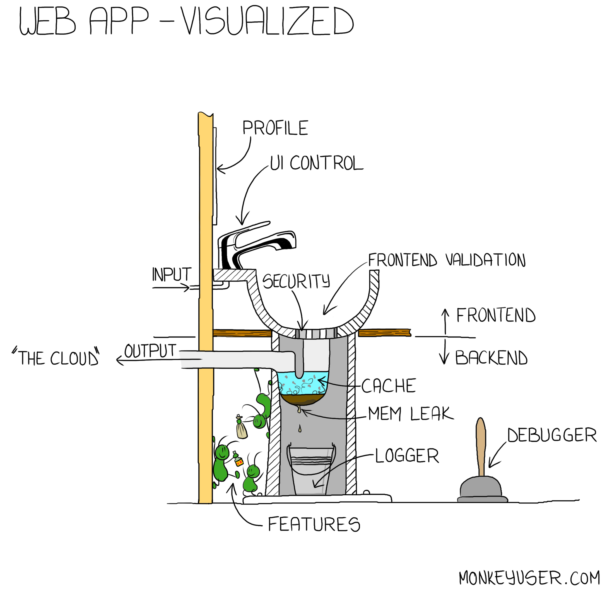
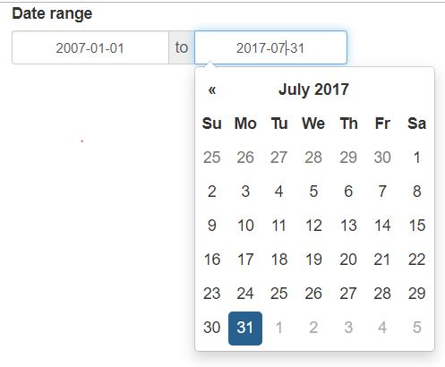
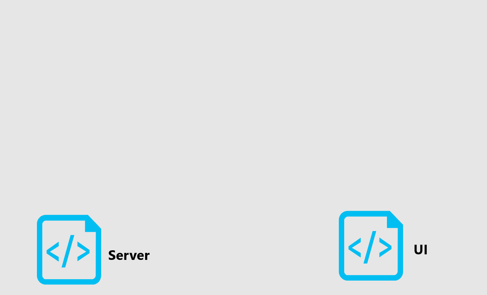
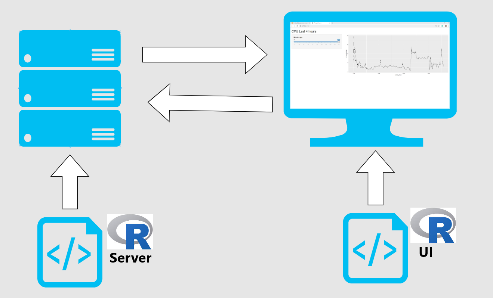
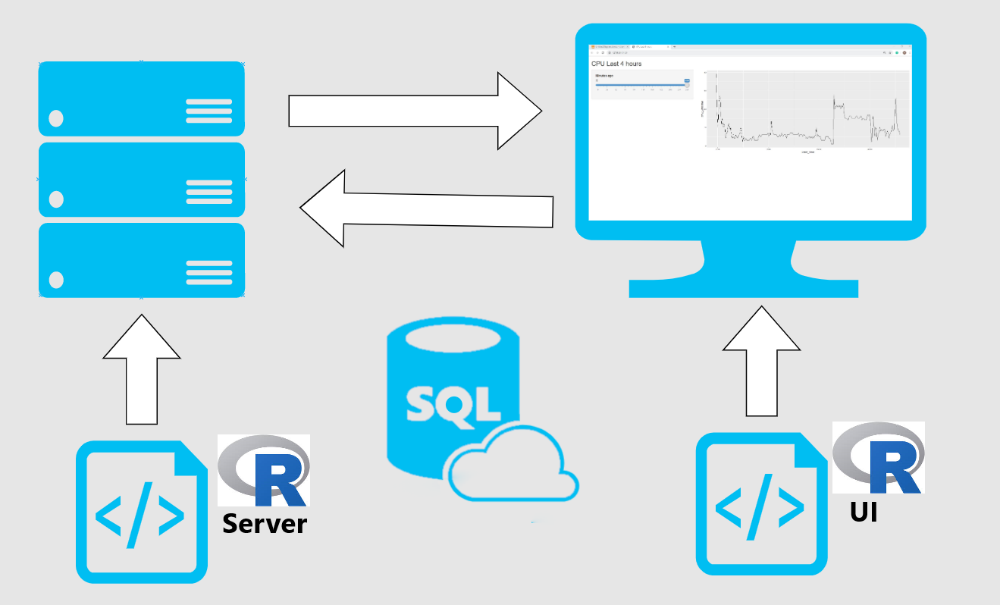
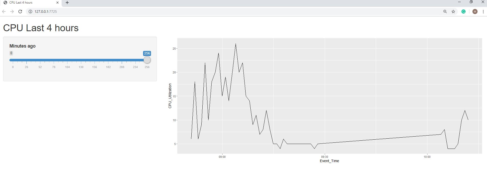
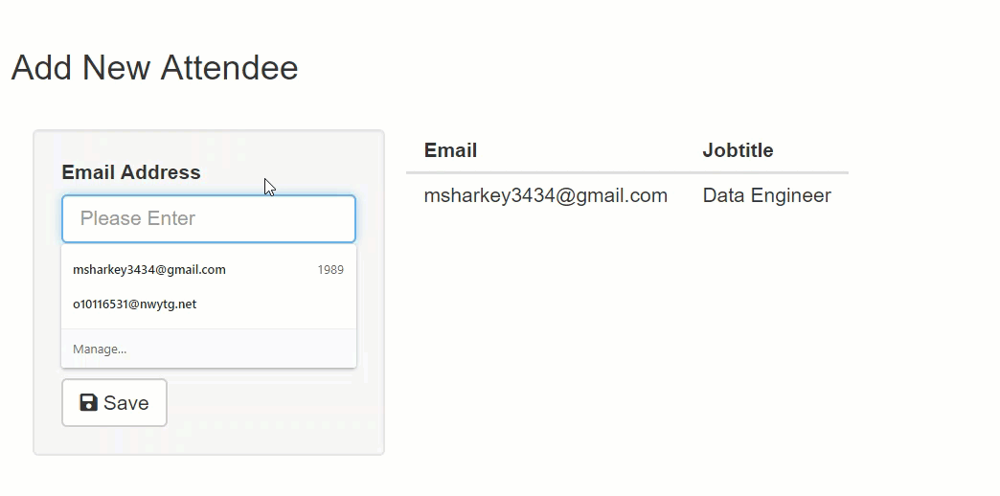
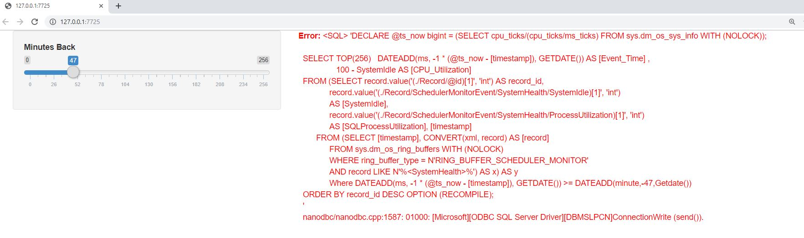
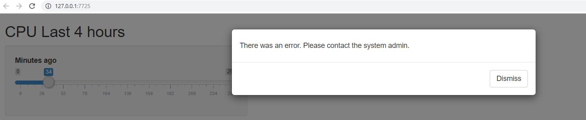

## About Me


.pull-left[
- Matt Sharkey, MBA, MS-BIA, MCSE

- DBA @ BuilderTrend

- Omaha, NE

- Hometown - Winner, SD

]
.pull-right[

]

---
## Session Overview


---
## What does a Data Engineer do?


---

# Sharing across the organization

- Requirements for user interaction, going beyond static reports

--

- Users need to create, read, update, delete data used in analysis

--

- 200 GB tables as data source

---


# Web Development Simplified

- Shiny -> R package for building web apps

--
```{r,eval=FALSE,echo=TRUE}
<h2>Hello World!</h2>
```

<h2>Hello World!</h2>

--

```{r,eval=TRUE,echo=TRUE}
library(shiny)

h2('Hello World!')

```


---
.pull-left[

```{r,eval=FALSE,echo=TRUE}
dateRangeInput("date"
   ,strong("Date range")
   ,start = "2007-01-01"
   ,end = "2017-07-31"
   ,min = "2007-01-01"
   ,max = "2017-07-31")
```
]

.pull-right[


]
--


```{r,eval=FALSE,echo=TRUE}
<div id="date">
<label class="control-label" for="date"> <strong>Date range</strong>
</label><div class="input-daterange input-group">
<input class="input-sm form-control" type="text"
data-date-week-start="0" data-date-format="yyyy-mm-dd"
data-date-start-view="month" data-min-date="2007-01-01" 
data-max-date="2017-07-31"data-initial-date="2007-01-01" 
data-date-autoclose="true"/><span class="input-group-addon">
to </span> <input  type="text" data-date-language="en" 
data-date-week-start="0" data-date-format="yyyy-mm-dd" 
data-min-date="2007-01-01" data-max-date="2017-07-31"/>
  </div></div>
```


---

## Pros

- Familiarity

--

- Supportability 

--

- Hosting Options https://www.shinyapps.io/

---

<center>
<iframe src="https://msharkey.shinyapps.io/myapp/" height="625" width="650"></iframe>
</center>

---

## Production Concerns


- Functionality?

--

- Performance?

--

- "R is not real programming"


---


class: inverse, center, middle

## Architecture

---




---



---



---

```{r,eval=FALSE}
library(shiny)
library(DBI)
library(odbc)

con <- dbConnect(drv = odbc(),
                 Driver = 'Sql Server',
                 Server = '.\\snapman',
                 Database = 'Test')


```


---

```{r,eval=FALSE}
library(shiny)
library(DBI)
library(odbc)

con <- dbConnect(drv = odbc(),
                 Driver = 'Sql Server',
                 Server = '.\\snapman',
                 Database = 'Test')

{{my_ui <- fluidPage()}}
 

```

---

```{r,eval=FALSE}
library(shiny)
library(DBI)
library(odbc)

con <- dbConnect(drv = odbc(),
                 Driver = 'Sql Server',
                 Server = '.\\snapman',
                 Database = 'Test')

my_ui <- fluidPage()
 
{{my_server <- function(input, output) {}}}

```

---

```{r,eval=FALSE}
library(shiny)
library(DBI)
library(odbc)

con <- dbConnect(drv = odbc(),
                 Driver = 'Sql Server',
                 Server = '.\\snapman',
                 Database = 'Test')

my_ui <- fluidPage()
 
my_server <- function(input, output) {}

{{shinyApp(ui = my_ui, server = my_server)}}
```

--

[Shiny Gallery](https://shiny.rstudio.com/gallery/see-more.html)


---
class: inverse, center, middle

## 01 - Sample App Demo




---
```{r,eval=FALSE}
  myquery <- paste0("Execute dbo.GetCPUutilization ",input$cpuInput)
```

--
```{r,eval=FALSE}
  myquery <- "Execute dbo.GetCPUutilization ?cpu_slider_param"
```
--
```{r,eval=FALSE}
myquery <- sqlInterpolate(con,myquery,
           .dots =c(cpu_slider_param <- input$cpu_slider))
```                                
--
```{r,eval=FALSE}
mydata <- dbGetQuery(con,myquery)
```

---

## Injection Risk




---

## Whitelist

```{r,eval=FALSE}
emailwhitelist <- "^[[:alnum:].-_]+@[[:alnum:].-]+$"

if(!is.na(str_match(usr_email, emailwhitelist))){
  ##Run query
} else
{
  ## Reject input
}
```

---

## Demo Recap

- Built a user slider control

--

- Defined space for plot output

--

- Added source query text

--

- Executed query

--

- Plotted results

--

- Bound user input to query string

--

- Replaced input var with parameter

---

class: inverse, center, middle


## Building and Managing Connections

---


## Building and Managing Connections

```{r,eval=FALSE}
{{con <-  dbConnect(drv = odbc::odbc(), }}
                    Driver = 'Sql Server',
                    Server = '.\\snapman',
                    Database = 'Test',
                    Trusted_Connection='yes')
    myquery <- ...
    mydata <- dbGetQuery(con,myquery)
    
    {{dbDisconnect(con)}}
```


--


```{r,eval=FALSE}
{{pool <- dbPool(drv = odbc::odbc(),}}
               Driver = 'Sql Server',
               Server = '.\\snapman',
               Database = 'Test')
my_ui <- ....
my_server <- function(input, output) {
  output$cpuPlot <- renderPlot({
    myquery <- ....
    myqueryint <- ...
    {{mydata <- dbGetQuery(pool,myqueryint)}}

```


---

class: inverse, center, middle


## 02 - Building and Managing Connections Demo

---

## Demo Recap

- Profiled session with profvis

--

- Identified bottleneck 


--

- Switched app to connection pooling

---

## Error Handling


<iframe src="https://giphy.com/embed/1RkDDoIVs3ntm" width="480" height="480" frameBorder="0" class="giphy-embed" allowFullScreen></iframe><p><a href="https://giphy.com/gifs/1RkDDoIVs3ntm">via GIPHY</a></p>


--

---

How would the app respond to a database error?



---

```{r,eval=FALSE}
results <- dbGetQuery(pool,myquery)
ggplot(results,aes(Event_Time,CPU_Utilization)) + geom_line()
    
```

--

```{r,eval=FALSE}
tryCatch({
{{ results <- dbGetQuery(pool,myquery)}}
{{ggplot(results,aes(Event_Time,CPU_Utilization))+ geom_line()}}
 },error =function(e) {
    showModal(modalDialog(
    h5('There was an error.  Please contact the system admin.")
      )
      )
  })
```


--




---

## Handling Deadlocks

```{r,eval=FALSE}
tryCatch({
    dbGetQuery(con,myquery)
}
,error = function(e){
  {{if(grep('1205',e$message)==1){}}
    while (x<4){
      tryCatch({
        dbGetQuery(con,myquery)
        break
        }
      ,error=function(e){
      x<<- x+1
      })
    }
  }
})
```

---


class: inverse, center, middle


## 03 - Error Handling Demo


---


## Demo Recap

- Forced database offline during active session

--

- No error handling displayed errors at the client and crashed session

--

- Added tryCatch around connection attempt and query attempt


---

## Load Testing 


App is fast with one user session  

--

What about 50 concurrent users?

--

```{r,eval=FALSE}
shinyloadtest::record_session('http://127.0.0.1:6696/')
```

--

```{sh,eval=FALSE}
$ shinycannon recording.log http://127.0.0.1:6696/ 
--workers 50 --loaded-duration-minutes 2
```

--

```{r,eval=FALSE,message=FALSE, warning=FALSE}
df <- shinyloadtest::load_runs("50workers" = "./test-log.997Z")

shinyloadtest::shinyloadtest_report(df, "run1.html")
```

---


class: inverse, center, middle


## 04 - Review Load Test Results


---

## Caching

```{r,eval=FALSE}
--OPTION (RECOMPILE);
```

--

renderPlot -> renderCachedPlot

--

```{r,eval=FALSE}
  },cacheKeyExpr = {input$cpu_slider})
```

---

class: inverse, center, middle

## 05 - Caching Demo

---


## Demo Recap


- Configured app for plot caching

--

- Analyzed load test results with caching


---


## Session Recap

- Built a sample app from the template

```{r,eval=FALSE}
con <- dbConnect(drv = odbc(),
                 Driver = 'Sql Server',
                 Server = '.\\snapman',
                 Database = 'Test')

my_ui <- fluidPage()
my_server <- function(input, output) {}
shinyApp(ui = my_ui, server = my_server)
```


--

- Fortified the app

  - Connection Pooling
  
  - Error Handling

--

- Scaled the app

  - Load Testing
  
  - Caching
  

---


## Additional Resources

Presentation Repo
https://github.com/msharkey/shinybuilder/tree/master/01-SQL_SAT_Presentation

Pluralsight
https://app.pluralsight.com/library/courses/r-programming-fundamentals/table-of-contents

Shiny Gallery
https://shiny.rstudio.com/gallery/

My E-book
https://bookdown.org/msharkey3434/ShinyDB_Book/

My Blog
https://www.hinttank.com/

Advanced R book
https://amzn.to/32qbna4

People to follow
@jcheng,@xieyihui,@hadleywickham,@drob


---

class: center, middle


---


class: center, middle


---

class: center, middle


---


class: center, middle

## Thank You

<iframe src="https://giphy.com/embed/n4oKYFlAcv2AU" width="480" height="270" frameBorder="0" class="giphy-embed" allowFullScreen></iframe><p><a href="https://giphy.com/gifs/n4oKYFlAcv2AU">via GIPHY</a></p>


