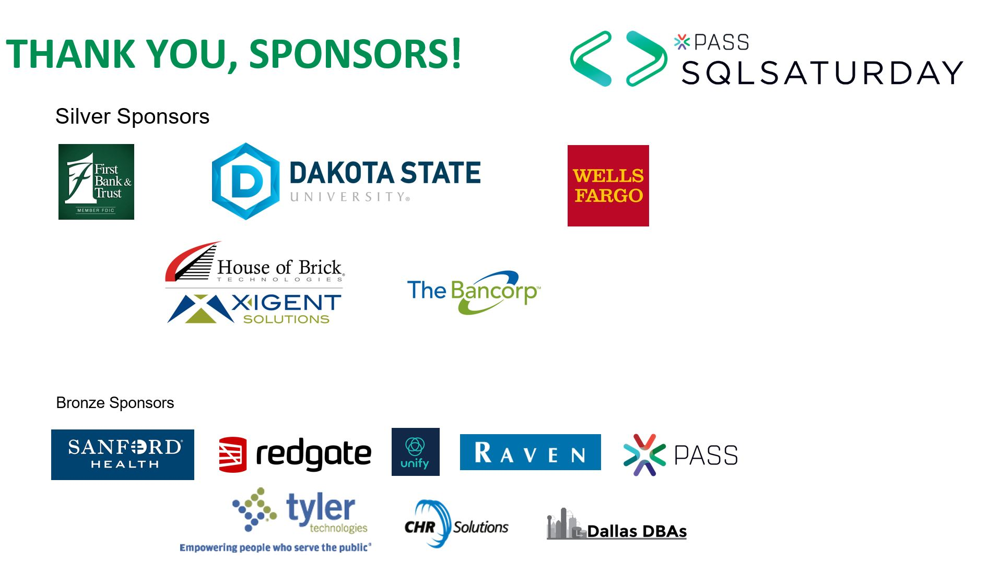

```{r setup, echo=FALSE,warning=FALSE,message=FALSE}
options(htmltools.dir.version = FALSE)
library(DBI)
library(dbplyr)
library(tidyverse)
library(kableExtra)
library(microbenchmark)
library(ggplot2)
#myDriver <- 'SQL Server'
#myServer <- '.\\snapman'
#myDatabase <- 'Cab_Demo'
#sqlchunk_connection <- dbConnect(odbc::odbc(),
#                          Driver= myDriver,
#                          Server = myServer,
#                          Database = myDatabase,
#                          Trusted_Connection='yes')
#comp <- Sys.info()
#if(comp["nodename"]=="OMC-5CG6151GZF"){
#  cab_fileloc <- "C:/Users/MaSharkey/Cab_Data/yellow_tripdata_2018-12.csv"} else {
#  cab_fileloc <- "D:/Cab_data/yellow_tripdata_2018-01.csv"
#  }
```


# Hello World

<div>
<center>
.pull-left[
-Matt Sharkey, MBA, MS-BIA, MCSE

-IT Database Administrator
]
.pull-right[

]


</center>
<div>


---

class: center, middle



---


class: center, middle


---

class: center, middle


---


# Agenda

1. The story behind this presentation

--

2. Building a sample app

-- 

3. 


---

# Web-Dev Simplified

- R packagage for building web apps

--
```{r,eval=FALSE,echo=TRUE}
<h2>Hello World!</h2>
```

<h2>Hello World!</h2>

--

```{r,eval=TRUE,echo=TRUE}
library(shiny)

h2('Hello World!')

```


---
```{r,eval=FALSE,echo=TRUE}
dateRangeInput("date", strong("Date range")
   ,start = "2007-01-01", end = "2017-07-31"
   ,min = "2007-01-01", max = "2017-07-31")
```

--

```{r,eval=FALSE,echo=TRUE}
<div id="date">
<label class="control-label" for="date"> <strong>Date range</strong>
</label><div class="input-daterange input-group">
<input class="input-sm form-control" type="text"
data-date-week-start="0" data-date-format="yyyy-mm-dd"
data-date-start-view="month" data-min-date="2007-01-01" 
data-max-date="2017-07-31"data-initial-date="2007-01-01" 
data-date-autoclose="true"/><span class="input-group-addon">
to </span> <input  type="text" data-date-language="en" 
data-date-week-start="0" data-date-format="yyyy-mm-dd" 
data-min-date="2007-01-01" data-max-date="2017-07-31"/>
  </div></div>
```

--

```{r,eval=TRUE,echo=FALSE,message=FALSE}
    
    shinyApp(
      ui = fluidPage(
      dateRangeInput("date", strong("Date range"), start = "2007-01-01",end = "2017-07-31",min = "2007-01-01", max = "2017-07-31")
  ),

  server = function(input, output) {},

  options = list(height = 500)
)
    
  
```

--

---


#Shiny Benefits

- Write application UI and Server side code in R

--


--

- Integrate R data analysis packages

--

- Hosting https://www.shinyapps.io/

---
<center>
<iframe src="https://msharkey.shinyapps.io/myapp/" height="625" width="650"></iframe>
</center>
---

class: inverse, center, middle

# Building and Managing Connections


---


```{r commonCon, eval=TRUE, warning=FALSE}
#myconnection <- DBI::dbConnect(odbc::odbc(),
#                          Driver= 'SQL Server',
#                          Server = '.\\snapman',
#                          Database = 'Cab_Demo',
#                          Trusted_Connection='yes')
```

--

```{r execQuery, eval=TRUE, warning=FALSE}

#dbGetQuery(myconnection,"Select GetDate()")
#dbDisconnect(myconnection)

```

---

# Additional Resources

Pluralsight
https://app.pluralsight.com/library/courses/r-programming-fundamentals/table-of-contents

Shiny Gallery
https://shiny.rstudio.com/gallery/

My E-book
https://bookdown.org/msharkey3434/ShinyDB_Book/

My Blog
https://www.hinttank.com/

Advanced R book
https://amzn.to/32qbna4

People to follow
@jcheng,@xieyihui,@hadleywickham,@drob


---


## Common Connection Problems

.pull-left[
1. Wrong connection string format 
    
1. Misspelled something

1. Permissions

1. Driver

1. Wrong port number

1. Firewall
]

.pull-right[
<center>
<iframe src="https://giphy.com/embed/Ym0zs6Ms4vgwU" width="380" height="227" frameBorder="0" class="giphy-embed" allowFullScreen></iframe><p><a href="https://giphy.com/gifs/mr-robot-rami-malek-its-so-good-Ym0zs6Ms4vgwU"></a></p>
</center>
]


---

## Manual vs Pool

```{r pool, eval=TRUE,echo=FALSE}
#library(pool)
#queries <- c("SELECT Getdate()","Select Getdate()","Select Getdate()","Select Getdate()")
#
#dbconnectworkload <- function() {
# for(i in 1:length(queries)){
#   con <- dbConnect(odbc::odbc(),Driver= myDriver,Server = myServer
#                   ,Database = myDatabase,Trusted_Connection='yes')
#  dbGetQuery(con,queries[i])
#  dbDisconnect(con)
# }
#}  
#
#poolcon <- dbPool(odbc::odbc(),Driver= myDriver,Server = myServer
#                  ,Database = myDatabase,Trusted_Connection='yes')
#
#dbpoolworkload <- function() {
# for(i in 1:length(queries)){dbGetQuery(poolcon,queries[i])}
#}


```

---

## Manual vs Pool Benchmark Results

```{r boxplot,echo=FALSE, fig.align = "center",eval=FALSE}
#rs<-as.data.frame(rs)
#rs$time <- rs$time/1000000
#names(rs) <- c("Connection_Type","Milliseconds")
#ggplot(rs, aes(x=Connection_Type, y=Milliseconds , fill=Connection_Type)) +
# geom_boxplot(alpha=0.4) +
#    theme(text = element_text(size=16))
#
```


---

class: inverse, center, middle

# Performance & Optimization

---


class: center, middle

# Thank You


